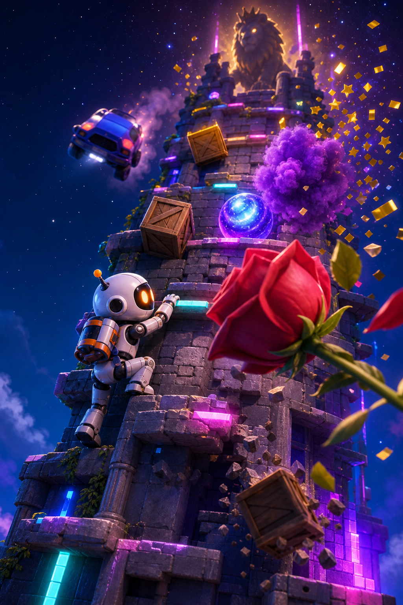
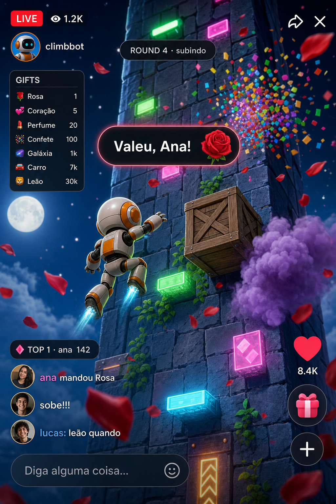

# TikTok LIVE Climb

Live **9:16** em que um **bot sobe sozinho**. O chat paga pra atrapalhar: gift vira obstáculo, fumaça, empurrão ou boss; um TTS agradece o doador. Zero operação durante a sessão — só ligar o stream.

**Status:** spec v1 · sem código ainda  
**Owner:** [Bruno Gonzaga Santos](https://github.com/obrunogonzaga)  
**Repo:** [obrunogonzaga/tiktok-live-climb](https://github.com/obrunogonzaga/tiktok-live-climb)  
**Tracker:** [Issues](https://github.com/obrunogonzaga/tiktok-live-climb/issues) · [Fase 1](https://github.com/obrunogonzaga/tiktok-live-climb/milestone/1)

Formato: lives tipo caos/climb (chat controla). Requisito duro: automação ponta a ponta.

---

## Look (norte visual)

Concept, não frame do Unity. Pegada: torre neon à noite, bot compacto, props chunky, caos de partícula. Arte final em Blender ([#7](https://github.com/obrunogonzaga/tiktok-live-climb/issues/7)), depois de greybox jogável ([#2](https://github.com/obrunogonzaga/tiktok-live-climb/issues/2)).

<p align="center">
  
  
</p>

<p align="center">
  <em>Esquerda — o jogo. Direita — a live no celular (ladder, toast, likes, comentários).</em>
</p>

O **Bot** vive no centro-esquerda da **safe zone**. A **Ladder** fica à esquerda. Likes/gifts do TikTok comem a direita; comentários comem o baixo. HUD do overlay é HTML, não Unity. Spec: [docs/overlay-capture.md](./docs/overlay-capture.md).

---

## O que o viewer vê

1. **Round** começa → o **Bot** sobe a torre.
2. Alguém manda **Gift** → obstáculo / empurrão / boss + voz “Valeu, {nome}!”.
3. O bot cai ou chega no topo → **Placar** do top gifter → reset sozinho.
4. Overlay mostra a **Ladder** o tempo todo.

Monetização = espetáculo da rosa barata + FOMO do degrau caro. Glossário: [CONTEXT.md](./CONTEXT.md) (`Ladder` ≠ `Placar`, `Bot` ≠ `Orchestrator`).

---

## Arquitetura

O jogo **nunca** fala com o TikTok. Só consome `LiveEvent` v1. Trocar TikFinity = só o **Bridge**.

```
TikTok LIVE
    │  gifts / likes / follows
    ▼
[Bridge]          TikFinity (MVP) → LiveEvent v1
    ▼
[Orchestrator]    fila, ladder, debounce TTS
    ├──► Unity          spawn / damage / reset do Bot
    ├──► TTS            ElevenLabs → wav → Virtual Cable
    └──► Overlay HTML   ladder / placar / toast
    ▼
Captura           LIVE Studio 1080×1920 → ar
```

Contrato: [docs/events.md](./docs/events.md) + [`schemas/live-event.v1.schema.json`](./schemas/live-event.v1.schema.json).

---

## Ladder v1 (BR)

Sete degraus no overlay. Coins, não reais. Gift fora da lista cai no **fallback por coins**, não no chão. Fonte: [docs/gift-ladder.md](./docs/gift-ladder.md) · runtime [`config/ladder.v1.toml`](./config/ladder.v1.toml).

| Gift (overlay) | coins | No jogo |
| --- | ---: | --- |
| Rosa | 1 | obstáculo pequeno |
| Coração | 5 | small + knockback |
| Perfume | 20 | fumaça / slow |
| Confete | 100 | obstáculo médio |
| Galáxia | 1_000 | knockback forte |
| Carro | 7_000 | multi-spawn |
| Leão | 29_999 | boss + highlight |

TTS: no máximo 1 fala / 2,5 s. O resto vira toast. Like não fala.

---

## Stack MVP

| Camada | Escolha |
| --- | --- |
| Jogo + **Bot** | Unity + C# · URP · 1080×1920 borderless · Windows na live |
| Eventos | TikFinity → **Bridge** → `LiveEvent` |
| Fila / TTS / overlay state | orchestrator local (HTTP + WebSocket) |
| Voz | ElevenLabs + fallback TTS local |
| Captura | TikTok LIVE Studio (OBS só se o Studio falhar) |
| Arte | Blender low-poly (hero). Greybox primeiro |

**Bot** = state machine `Idle → Climb → Avoid → Recover → Celebrate → Reset`. LLM fora do gameplay.

---

## Repo

```
.
├── ONEPAGER.md              produto, fases, riscos
├── CONTEXT.md               glossário
├── AGENTS.md                o que um agente lê antes de codar
├── config/ladder.v1.toml    ladder editável sem rebuild
├── docs/
│   ├── gift-ladder.md
│   ├── events.md
│   ├── overlay-capture.md
│   └── refs/                concepts 9:16 (este README)
└── schemas/
    ├── live-event.v1.schema.json
    └── overlay-state.v1.schema.json
```

Ainda não há pasta Unity. Scaffold é a [#2](https://github.com/obrunogonzaga/tiktok-live-climb/issues/2).

---

## Docs

| Doc | Fonte da verdade de |
| --- | --- |
| [ONEPAGER.md](./ONEPAGER.md) | Loop, stack, fases, aceite, riscos |
| [CONTEXT.md](./CONTEXT.md) | Língua do domínio |
| [docs/gift-ladder.md](./docs/gift-ladder.md) | 7 gifts, fallback, TTS |
| [docs/events.md](./docs/events.md) | Envelope `LiveEvent` v1, mapa TikFinity |
| [docs/overlay-capture.md](./docs/overlay-capture.md) | Canvas, safe zone, Studio/OBS, áudio |
| [AGENTS.md](./AGENTS.md) | Ordem de leitura pra implementar |

---

## Fase 1 — issues

Cada issue AFK é um **prompt** (Before / Build / Out of scope / Validate). Locks globais em [AGENTS.md](./AGENTS.md). Fixtures em `fixtures/events/`.

| # | O quê | Tipo |
| --- | --- | --- |
| [#1](https://github.com/obrunogonzaga/tiktok-live-climb/issues/1) | Style bible da pegada | HITL |
| [#2](https://github.com/obrunogonzaga/tiktok-live-climb/issues/2) | Torre greybox + bot sobe / reseta | AFK |
| [#3](https://github.com/obrunogonzaga/tiktok-live-climb/issues/3) | `LiveEvent` synthetic → 3 spawns | AFK |
| [#4](https://github.com/obrunogonzaga/tiktok-live-climb/issues/4) | Overlay HTML 9:16 | AFK |
| [#5](https://github.com/obrunogonzaga/tiktok-live-climb/issues/5) | TTS 1 voz + fila 2,5 s | AFK |
| [#6](https://github.com/obrunogonzaga/tiktok-live-climb/issues/6) | Captura LIVE Studio 15 min | HITL |
| [#7](https://github.com/obrunogonzaga/tiktok-live-climb/issues/7) | Art pass Blender (bot + kit + 3 gifts) | AFK + review |
| [#8](https://github.com/obrunogonzaga/tiktok-live-climb/issues/8) | TikFinity real → `LiveEvent` | HITL |
| [#9](https://github.com/obrunogonzaga/tiktok-live-climb/issues/9) | Ladder completa + Leão + placar | AFK |

`HITL` = precisa do Bruno (conta, Studio, OK visual). `AFK` = dá pra implementar sem ele no loop. **#1** e **#2** já podem começar em paralelo.

Mãos livres (quando a Fase 1 fechar): bot joga sozinho, gift spawna sozinho, TTS sozinho, round reseta sozinho, overlay sempre visível, fila TTS aguenta raid, **Bridge** reconecta, log CSV pós-live.

Manual aceitável: 1× Go Live + olhar ToS. Não aceitável: reagir a gift na mão ou pilotar o **Bot**.

---

## Arte

1. Greybox (cápsula, cubos) até o climb funcionar.
2. Style bible ([#1](https://github.com/obrunogonzaga/tiktok-live-climb/issues/1)) a partir destes refs.
3. Blender box modeling: **Bot** + 8–12 peças de torre + 3 props MVP (rosa, caixa, fumaça). `*.blend` no git; `*.blend1` ignorado.
4. Unity: FBX + VFX. Gifts = prop + partícula, não cutscene.

Meshy só se um prop travar. Hero (**Bot**) não.

---

## Rodar

Ainda não há build. Quando existir: Unity 1080×1920 borderless, overlay em `http://127.0.0.1:8790/`, eventos em `POST /v1/events`. Até lá, o “run” é abrir uma issue da Fase 1.

Secrets (ElevenLabs, etc.) ficam em `.env` local — nunca no git.

---

## Contribuir

Issue tracker é o GitHub deste repo. Spec primeiro, código depois. Agentes: ler [AGENTS.md](./AGENTS.md) antes de tocar em qualquer coisa.
